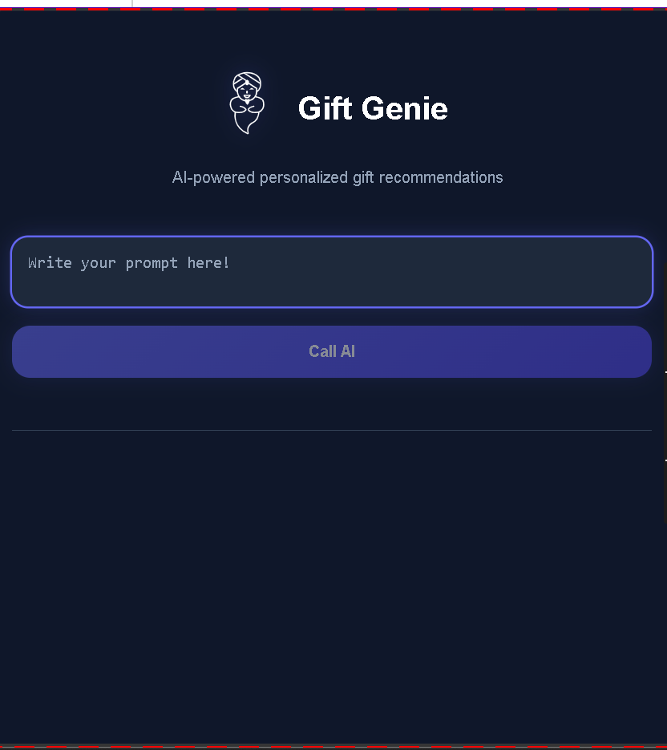
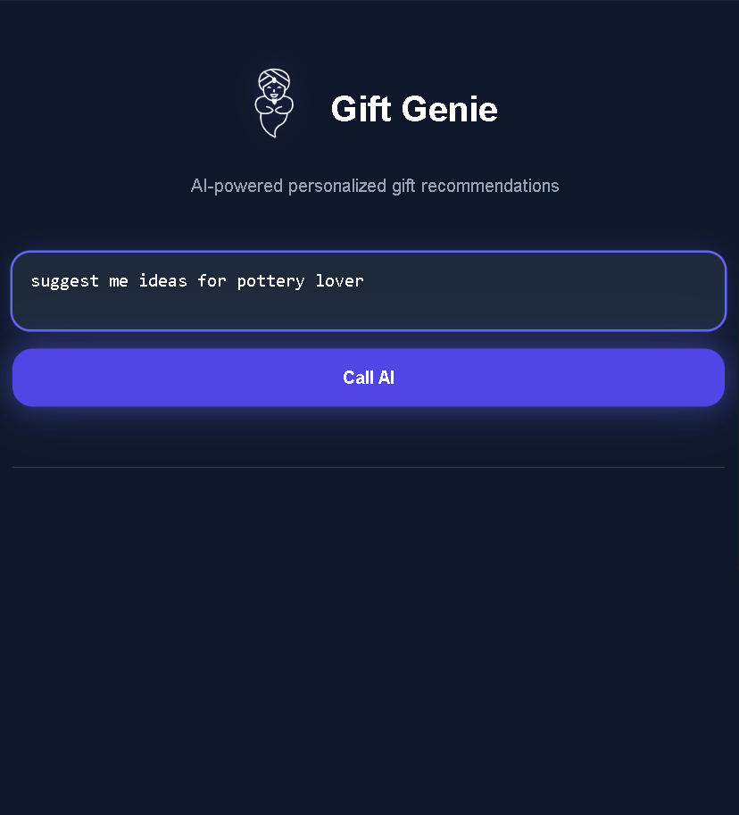
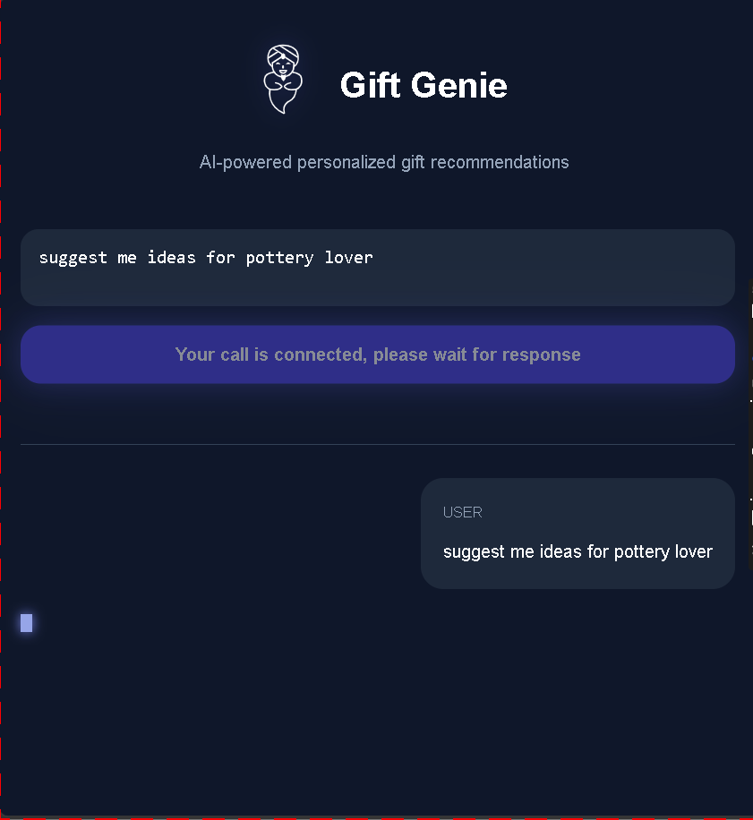
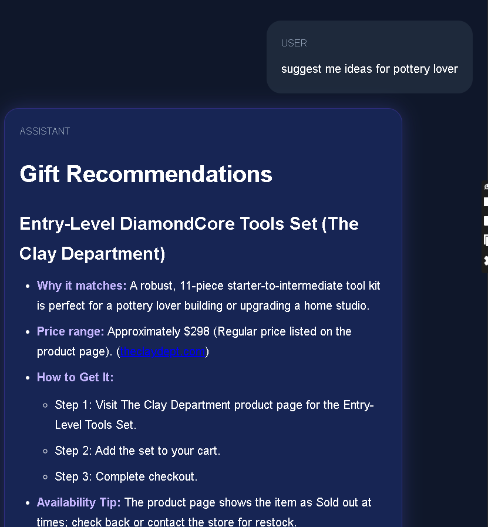

# Gift Genie AI 🎁✨

AI-powered personalized gift recommendation app built with **React**, **Vite**, and the **OpenAI API**.
Gift Genie generates thoughtful, structured, and beautifully formatted gift suggestions based on user prompts using real-time AI streaming responses.

---

## 🚀 Features

* ⚡ Real-time AI streaming responses
* 🎨 Beautiful modern dark UI
* 🧠 Personalized gift recommendations
* 📝 Markdown-rendered AI responses
* 🔒 Sanitized HTML rendering with DOMPurify
* 💬 Chat-style conversation interface
* 🔄 Smooth auto-scrolling during streaming
* 🌐 OpenAI Responses API integration
* 🔍 Web search enabled AI responses
* 📱 Responsive layout

---

# 🖼️ Screenshots

## Home Screen



---

## User Prompt



---

## Loading State



---

## AI Response Example



---

## Structured Markdown Output


---

# 🛠️ Tech Stack

* React
* Vite
* JavaScript
* OpenAI API
* React Markdown
* Remark GFM
* Rehype Sanitize
* DOMPurify
* CSS3

---

# 📦 Installation

Clone the repository:

```bash
git clone https://github.com/ThisisAlam/gift-genie-AI-app.git
```

Go into the project directory:

```bash
cd gift-genie-AI-app/gift-genie-ai
```

Install dependencies:

```bash
npm install
```

---

# 🔑 Environment Variables

Create a `.env` file in the root directory:

```env
VITE_AI_KEY=your_openai_api_key
VITE_AI_MODEL=gpt-5-nano
VITE_AI_URL=https://api.openai.com/v1
```

---

# ▶️ Run The Project

```bash
npm run dev
```

---

# 🧠 Example Prompt

```text
Suggest gift ideas for a pottery lover with a budget of $100
```

---

# ✨ AI Features Implemented

* Streaming AI text generation
* Structured Markdown formatting
* Follow-up recommendation questions
* Persistent chat history
* Assistant & user message rendering
* Secure markdown sanitization
* Auto-scroll to latest message

---

# 📁 Project Structure

```bash
gift-genie-ai/
│
├── public/
├── src/
│   ├── assets/
│   ├── App.jsx
│   ├── App.css
│   ├── index.css
│   ├── instructions.js
│   ├── schema-responses.js
│   └── utils.js
│
├── .env
├── package.json
├── vite.config.js
└── README.md
```

---

# 🔐 Security

This project sanitizes AI-generated markdown using:

* DOMPurify
* rehype-sanitize

to help prevent unsafe HTML rendering.

---

# 📚 What I Learned

While building this project I practiced:

* React state management
* Async/Await
* Streaming API responses
* Markdown rendering
* AI frontend architecture
* Secure rendering practices
* Auto-scrolling chat interfaces
* Environment variable handling
* OpenAI Responses API

---

# 🌟 Future Improvements

* Conversation memory
* Typing animations
* Save chat history
* Theme switcher
* Voice input
* Authentication
* Deploy to Vercel

---

# 📄 License

This project is open-source and available under the MIT License.

---

# 👨‍💻 Author

Built with ❤️ by Fakhar Alam.
